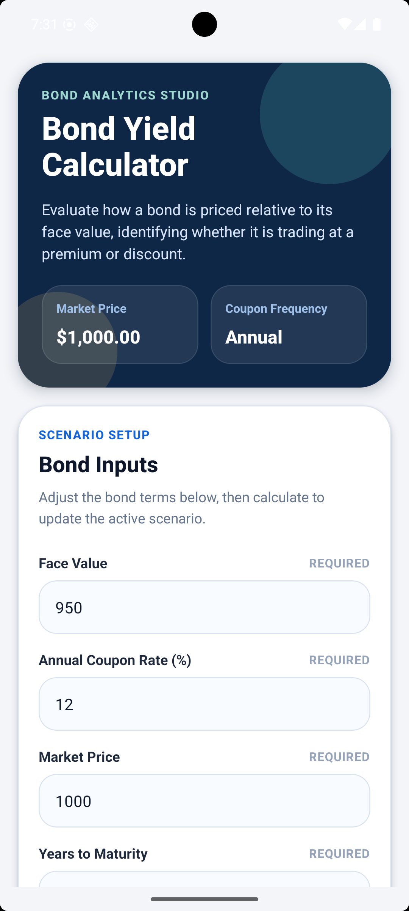
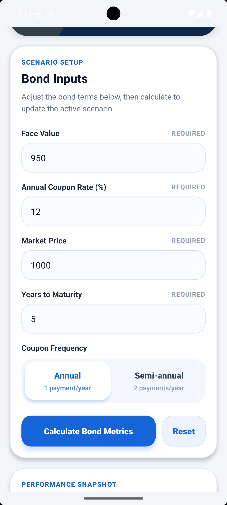
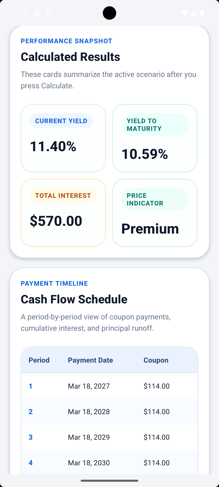

# Bond Yield Calculator

## Overview
A React Native mobile app to calculate bond metrics including current yield, YTM, total interest, and cash flow schedule.

## Features
- Current Yield calculation
- Yield to Maturity (YTM)
- Total Interest Earned
- Premium / Discount indicator
- Cash Flow Schedule

## Tech Stack
- React Native
- TypeScript

## How to Run
npm install
npx react-native run-android

## Sample Input
Face Value: 1000
Coupon Rate: 8%
Market Price: 950
Years: 5
Frequency: Semi-annual

## Screenshot

## Notes
YTM is calculated using binary search approximation.
